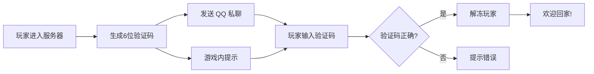

# 🌟 StarLogin - 双因素认证登录系统

<div align="center">

**为你的 Minecraft 服务器提供高级安全保护** 🛡️

</div>

---

## 📖 简介

StarLogin 是一款专为 Minecraft 服务器设计的**智能双因素认证系统**,通过 QQ 机器人实现玩家身份验证,有效防止账号盗用、恶意登录等安全问题。

### ✨ 核心亮点

- 🔐 **双因素认证** - 结合游戏账号与 QQ 账号,双重保障
- ⚡ **智能防抖** - 30秒内重复登录自动复用验证码,避免刷屏骚扰
- 🕐 **时效管理** - 验证码10分钟自动过期,安全可靠
- 🤖 **QQ 深度集成** - 自动向绑定 QQ 发送私聊消息
- 🎮 **游戏内提示** - 实时显示验证状态和操作指引
- 🧹 **自动清理** - 定时清理过期验证码,保持系统高效运行
- 📊 **完整日志** - 详细记录所有验证操作,便于审计和排查

---

## 🎯 功能特性

### 1️⃣ 玩家登录流程



### 2️⃣ 安全机制

| 功能 | 说明 | 优势 |
|------|------|------|
| **验证码生成** | 6位随机数字 | 简单易记,100万种组合 |
| **时效控制** | 10分钟有效期 | 防止验证码被窃取后滥用 |
| **防抖机制** | 30秒内复用验证码 | 避免频繁生成,提升体验 |
| **绑定验证** | 必须使用绑定的 QQ | 防止他人冒用 |
| **自动清理** | 每小时清理过期数据 | 节省内存,保持高效 |

### 3️⃣ 用户体验优化

- 🎨 **彩色游戏内提示** - 使用 Minecraft 颜色代码,清晰易读
- 💬 **友好错误提示** - 详细说明错误原因和解决方法
- 🔄 **无缝重连** - 短时间内重连无需重新验证
- 📱 **移动端友好** - QQ 消息推送到手机,随时随地验证

---

## 🚀 快速开始

### 环境要求

- ✅ EasyBot SDK 支持
- ✅ Minecraft 服务器(支持自定义指令)
- ✅ QQ 机器人账号
- ✅ 数据库支持(用于玩家绑定)

### 安装步骤

1. **下载插件**
   ```bash
   git clone https://github.com/thisxiaoyuQAQ/starlogin.git
   cd starlogin
   ```

2. **配置机器人 QQ 号**

   编辑 [main.js:5](main.js#L5),修改 `botQQ` 为你的机器人 QQ 号:
   ```javascript
   const config = {
       botQQ: "你的机器人QQ号"
   };
   ```

3. **配置服务器 Token**

   编辑 [main.js:58](main.js#L58),修改服务器验证 Token:
   ```javascript
   if (!(server.Session.Info.CachedServerToken === "你的服务器Token")) {
       return
   }
   ```

4. **加载插件**

   将插件文件夹放入 EasyBot 插件目录,重启机器人即可。

---

## 📚 使用指南

### 玩家端操作

#### 1. 首次绑定
玩家需要先在游戏内完成 QQ 账号绑定(具体绑定指令由服务器提供)。

#### 2. 登录验证
```
1️⃣ 进入服务器
2️⃣ 查看游戏内提示或 QQ 私聊消息
3️⃣ 向机器人私聊发送: #login 验证码
4️⃣ 验证成功,解冻完成!
```

#### 3. QQ 指令

| 指令 | 功能 | 示例 |
|------|------|------|
| `#login 验证码` | 提交验证码完成登录 | `#login 123456` |
| `!help` 或 `!帮助` | 查看帮助信息 | `!help` |

### 管理员配置

#### 自定义验证码有效期
修改 [main.js:47](main.js#L47):
```javascript
const tenMinutesInMs = 10 * 60 * 1000; // 改为你需要的时长(毫秒)
```

#### 调整防抖时间
修改 [main.js:68](main.js#L68):
```javascript
const thirtySeconds = 30 * 1000; // 改为你需要的时长(毫秒)
```

#### 修改游戏内指令
修改 [main.js:269-276](main.js#L269-L276) 的指令模板:
```javascript
await server.SendRunCommandAsync(playerName, `你的自定义指令`, false);
```

---

## 🔧 技术架构

### 核心模块

```
StarLogin
├── 🎲 验证码生成器
│   └── 6位随机数字 (100000-999999)
│
├── 💾 验证信息存储
│   └── Map<玩家名, {验证码, 时间戳, QQ号, Server}>
│
├── 🔍 数据库查询
│   ├── 查询玩家绑定信息
│   └── 查询 QQ 绑定的玩家
│
├── 📡 事件监听
│   ├── player_login - 玩家登录事件
│   ├── direct_message_event - QQ 私聊消息
│   └── raw_message_event - 消息上下文
│
└── 🧹 定时任务
    └── 每小时清理过期验证码
```

### 数据流图

```
玩家登录 → 生成验证码 → 存储到 Map
                    ↓
              发送 QQ 消息
                    ↓
              游戏内提示

玩家发送 #login → 查询数据库获取玩家名
                    ↓
              验证码匹配
                    ↓
              执行解冻指令
                    ↓
              清理验证信息
```

---

## 🛡️ 安全特性

### 防护机制

| 威胁类型 | 防护措施 | 实现位置 |
|---------|---------|---------|
| **验证码泄露** | 10分钟自动过期 | [main.js:234-243](main.js#L234-L243) |
| **重放攻击** | 验证成功后立即删除 | [main.js:292](main.js#L292) |
| **暴力破解** | 6位数字 + 时效限制 | [main.js:34-36](main.js#L34-L36) |
| **冒用账号** | 必须使用绑定 QQ | [main.js:187-214](main.js#L187-L214) |
| **刷屏攻击** | 30秒防抖机制 | [main.js:66-101](main.js#L66-L101) |

### 最佳实践

1. ✅ **定期更换服务器 Token**
2. ✅ **启用 QQ 机器人风控**
3. ✅ **监控日志异常行为**
4. ✅ **定期备份玩家绑定数据**
5. ✅ **限制机器人好友数量**

---

## 📊 日志示例

```log
[StarLogin] 服务器登录插件已加载
[StarLogin] 玩家 Steve(uuid-123) 登录,生成验证码: 456789
[StarLogin] 玩家 Steve 绑定的QQ: 123456789, 平台: qq
[StarLogin] 已向玩家 Steve(QQ:123456789) 发送登录提示消息
[StarLogin] 已向玩家 Steve 发送游戏内提示
[StarLogin] QQ 123456789 绑定的玩家: Steve
[StarLogin] 玩家 Steve(QQ:123456789) 验证码正确,开始执行解冻操作...
[StarLogin] 解冻命令执行完成: endlogin Steve
[StarLogin] 欢迎标题发送完成
[StarLogin] 玩家 Steve(QQ:123456789) 所有命令执行完成,登录流程结束
[StarLogin] 已清理玩家 Steve 的验证信息
```

---

## 🎨 界面展示

### 游戏内效果
```
[系统] §a§lSteve 请完成验证
[系统] §a§l请私聊机器人(725439308)并发送: #login 456789

验证成功后:
[系统] §a§lSteve 欢迎回家!
```

### QQ 消息效果
```
亲爱的 Steve
您进入了服务器!
请发送验证码来完成登录:
#login 456789
如果不是您本人登录,请及时联系服主或管理员!
```

---

## 🐛 故障排查

### 常见问题

<details>
<summary><b>Q: 收不到 QQ 验证码消息?</b></summary>

**可能原因:**
1. 玩家未绑定 QQ 账号
2. 机器人被对方拉黑
3. QQ 机器人掉线
4. `context` 上下文未初始化

**解决方法:**
- 检查数据库绑定信息
- 查看日志中的错误提示
- 确认机器人在线状态
- 等待机器人接收到任意消息后重试
</details>

<details>
<summary><b>Q: 验证码总是提示错误?</b></summary>

**可能原因:**
1. 输入的验证码格式不正确
2. 验证码已过期(超过10分钟)
3. 使用了旧的验证码

**解决方法:**
- 确保格式为 `#login 123456`(6位数字)
- 重新进入服务器获取新验证码
- 检查是否有多余空格
</details>

<details>
<summary><b>Q: 游戏内指令执行失败?</b></summary>

**可能原因:**
1. 服务器 Token 不匹配
2. 玩家名不正确
3. 服务器不支持相关指令

**解决方法:**
- 检查 [main.js:58](main.js#L58) 的 Token 配置
- 确认服务器安装了 `vtitle`、`vtell`、`endlogin` 指令插件
- 查看服务器控制台错误日志
</details>

---

## 🔄 更新日志

### v1.0.0 (当前版本)
- ✨ 初始版本发布
- 🔐 实现双因素认证核心功能
- ⚡ 添加智能防抖机制
- 🤖 集成 QQ 机器人消息推送
- 🧹 实现自动清理过期验证码
- 📊 完善日志记录系统

---

## 🤝 贡献指南

欢迎提交 Issue 和 Pull Request!

### 开发规范
1. 遵循现有代码风格
2. 添加必要的注释
3. 测试所有功能
4. 更新相关文档

### 贡献流程
```bash
# Fork 本项目
# 创建功能分支
git checkout -b feature/amazing-feature

# 提交更改
git commit -m '✨ Add amazing feature'

# 推送到分支
git push origin feature/amazing-feature

# 创建 Pull Request
```

---

## 📄 开源协议

本项目采用 MIT 协议开源,详见 [LICENSE](LICENSE) 文件。

---

## 👨‍💻 作者

**ZhiYu**

- 💼 作者主页: [GitHub Profile](https://github.com/thisxiaoyuQAQ)
- 📧 联系邮箱: your.email@example.com
- 🎮 Discord: YourDiscord#1234

---

## 🌟 致谢

感谢以下项目和社区的支持:

- [EasyBot SDK](https://github.com/easybot) - 强大的机器人开发框架
- Minecraft 服务器社区
- 所有为本项目做出贡献的开发者

---

## 📞 支持与反馈

如果你觉得这个项目有帮助,请给我们一个 ⭐ Star!

- 🐛 [报告 Bug](https://github.com/thisxiaoyuQAQ/starlogin/issues)
- 💡 [功能建议](https://github.com/thisxiaoyuQAQ/starlogin/issues)
- 💬 [讨论交流](https://github.com/thisxiaoyuQAQ/starlogin/discussions)

---

<div align="center">

**用 ❤️ 和 ☕ 制作**

Made with ❤️ by ZhiYu

</div>